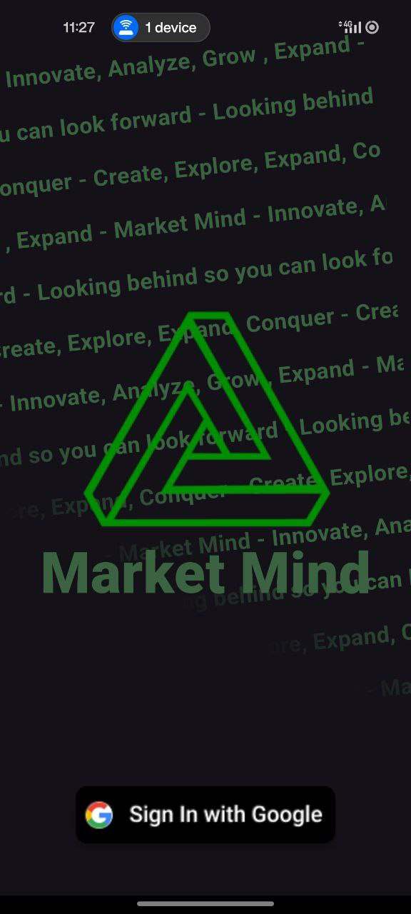
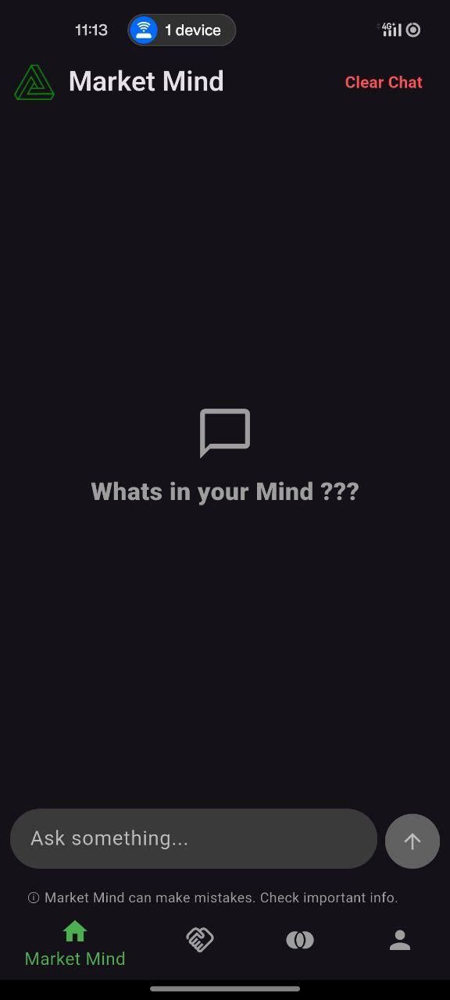
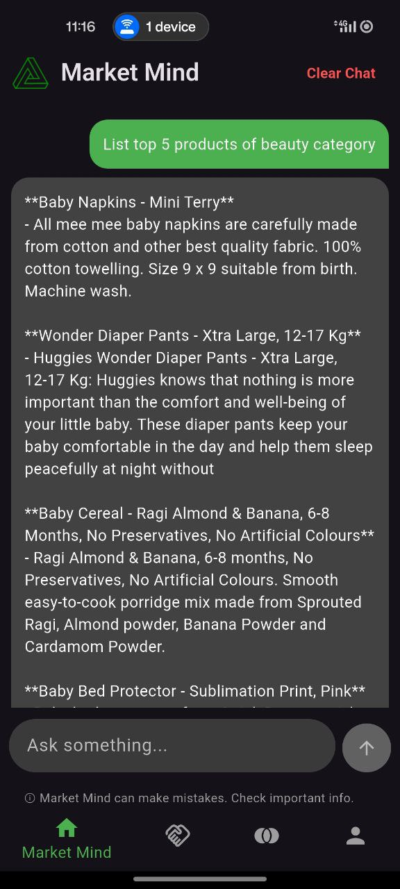
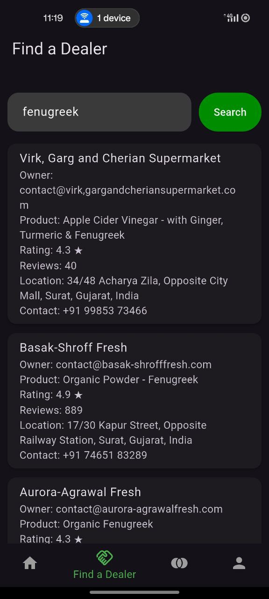
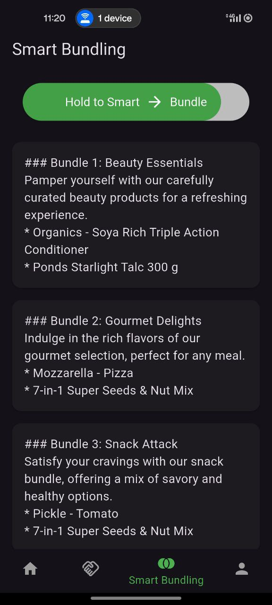
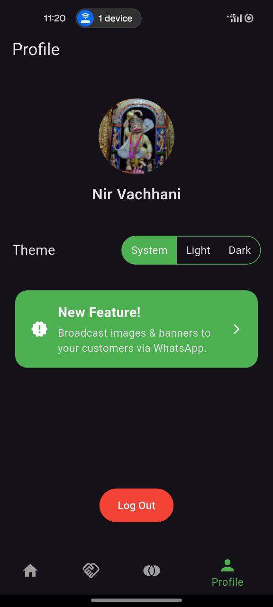

# 🧠 MarketMind

MarketMind is an AI-powered business assistant designed for retailers and shopkeepers. It transforms natural language queries into actionable insights, enabling smarter inventory decisions, dealer discovery, and efficient product promotion—all from a user-friendly mobile app.

## 🚀 Features

- **🧾 AI Chat Interface:** Ask business questions and get smart, real-time answers powered by a custom LLaMA 3 LLM model.
- **📊 Data Insights:** Connects to PostgreSQL to analyze sales trends and inventory data.
- **🛒 Smart Bundling:** Recommends bundle deals for expiring or overstocked items to boost sales.
- **📍 Dealer Finder:** Search for nearby suppliers with product-specific filters (price, quality, top-sellers).
- **📤 WhatsApp Channeling:** Share promotional banners or messages directly to customers via WhatsApp.
- **🧠 RAG + LLM Backend:** Combines Flask + Together API to integrate retrieval-augmented generation for more grounded insights.
- **📱 Built with Flutter:** Beautiful cross-platform UI with animated chat, session history, and Google Sign-In.
- **☁️ Firebase Integration:** Manages user sessions, chat storage, dynamic links, and Google authentication.

## 🧩 Tech Stack

| Technology       | Role                          |
|------------------|-------------------------------|
| Flutter          | Frontend UI (Mobile/Web)      |
| Flask            | Python backend server         |
| PostgreSQL       | Source of structured sales data |
| Firebase         | Auth, Firestore, Dynamic Links |
| LLaMA 3 (via Together API) | Natural language generation |
| LangChain + Chroma | RAG & vector database         |

## 📸 Screenshots

 Authentication | Chat Interface | Chat Messages | Dealer Finder | Smart Bundling | Profile
|----------------|----------------|----------------|
  | ) | ) |  |  | )

## 🛠️ Setup Instructions

1. **Backend:**
   - Navigate to `backend/`
   - Install dependencies: `pip install -r requirements.txt`
   - Run the server: `python app.py`
   - Make sure PostgreSQL is running and configured.

2. **Frontend (Flutter):**
   - Navigate to `marketmind_app/`
   - Run: `flutter pub get`
   - Launch: `flutter run`

3. **Firebase Setup:**
   - Add your `google-services.json` and `GoogleService-Info.plist` files.
   - Enable Firebase Auth and Firestore.

4. **Together API:**
   - Set your Together API key securely in the Flask backend.
   - Uses LLaMA 3 70B for response generation.

## 📂 Folder Structure

